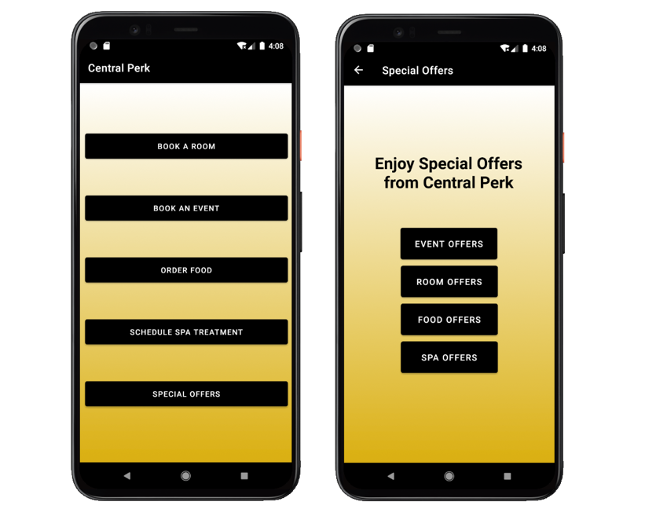
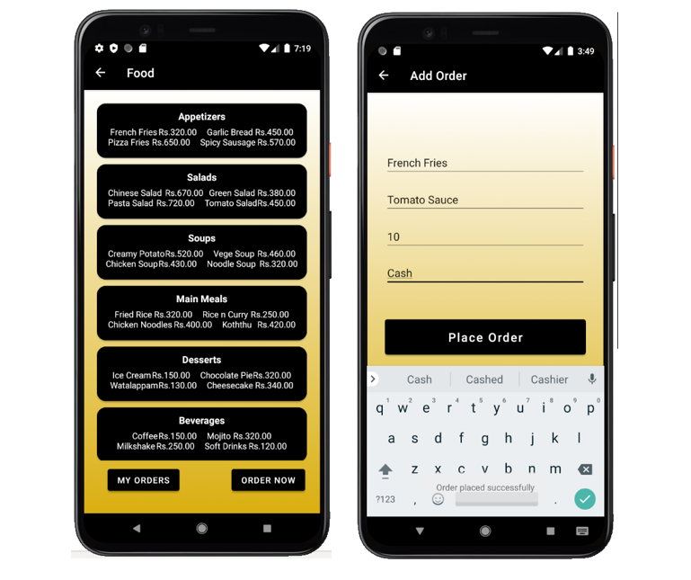
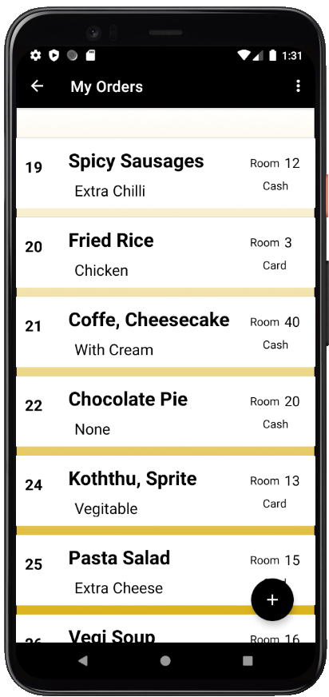
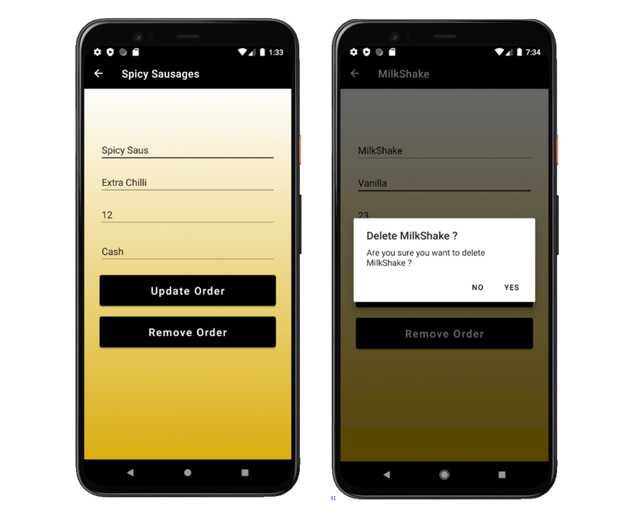
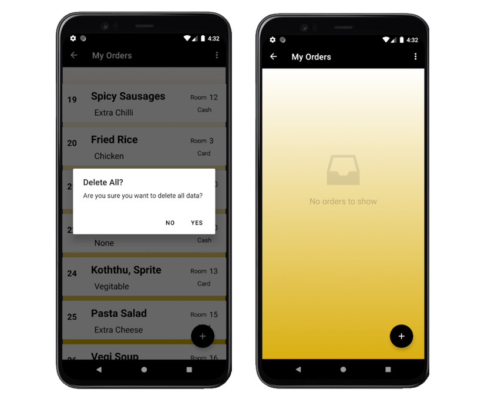
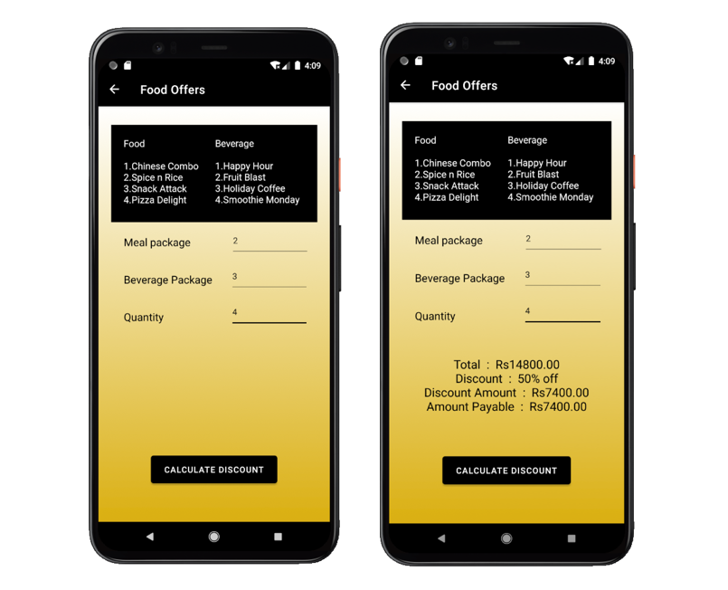

# CentralPerk_Food-Ordering
'Mobile application for Central Perk Resort & Spa' was a group project for 'Mobile Application Development' module in 2nd semester of 2nd year. Booking rooms & events, ordering food and spa appointments were developed by group members. Special offers were also provided by the app.

## Food Ordering Management (Individual part)

### Guests can order the food items to their room. They can place orders by filling the form.

### All previous orders can be viewed.

### Guests can update / delete a particular order.

### They can delete all the previous orders at once. Before removing the food orders, it will ask user to confirm.

### Special offers are calculated by the app.

## Tools & technologies
- Language - Java
- Database - Local(SQLite)
- Platform - Android Studio
